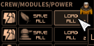

# Shortest Trip To Earth - Load Crew Only



A mod to load only the crew positions from a preset.  Press Right Click on the Load button to only move the crew.

Left Click and the preset hotkeys are not affected. 

# Steam Workshop
For Steam Users, subscribing to this mod does not install the mod.
Follow [Installation section](#installation) instructions below to install.

## Combat Example:
Player is in combat.  During combat, modules (such as weapons) were changed since a preset was loaded.  Enemies board the ship, which causes the player to move crew to attack.  Afterwards, the player wants to return the crew to their weapons as well as return the crew to their spread out locations so a single hit doesn't kill them.

The user can reload the preset, but the module changes and power settings will be reverted.  With this mod, Right Clicking the preset will move the crew back to the preset's locations without affecting power or modules.

# Compatibility
* Some mods instruct the user to overwrite the game's original files.  This mod may not be compatible with those mods.
    * This mod does not affect the original game files.
* Safe to add and remove from existing saves.

# Support
If you enjoy my mods and want to buy me a coffee, check out my [Ko-Fi](https://ko-fi.com/nbkredspy71915) page.
Thanks!

# Installation 

This section covers how to install the BepInEx mod loader and the mod itself.

## BepInEx Setup
If BepInEx has already been installed, skip to the [Mod Install](#mod-install) section.

* Download BepInEx from https://github.com/BepInEx/BepInEx/releases/download/v5.4.23.2/BepInEx_win_x64_5.4.23.2.zip
* Extract the contents of the BepInEx zip file into the game's directory:
```<Steam Directory>\steamapps\common\Shortest Trip to Earth```
    
    __Important__:  The .zip file *must* be extracted to the root folder of the game.  If BepInEx was extracted correctly, the following directory will exist: ```<Steam Directory>\steamapps\common\Shortest Trip to Earth\BepInEx```.  

    A common issue is extracting the .zip with the .zip name.  Ex: ```BepInEx_win_x64_5.4.23.1/BepInEx```.  If this occurs, move the ```BepInEx``` sub directory to the game's root directory.

* Run the game.  Once the main menu is shown, exit the game.  
* If the install was successful, there will now be a ```<Game Dir>/BepInEx/plugins``` directory.

## Mod Install
* Download the LoadCrewOnly.zip.  
    * If on Nexumods.com, download from the Files tab.
    * Otherwise, download from https://github.com/NBKRedSpy/STTE-LoadCrewOnly/releases/
* Extract the contents of the zip file into the ```<Game Dir>/BepInEx/plugins``` folder.
* Run the Game.  The mod will now be enabled.

# Uninstalling

## Uninstalling This Mod Only

This method removes this mod, but keeps the BepInEx mod loader and any other mods.

Delete the directory ```<Steam Directory>\steamapps\common\Shortest Trip to Earth\BepInEx\plugins\LoadCrewOnly```.

## Uninstall the Mod and BepInEx
This resets the game to an unmodded state by deleting BepInEx and any BepInEx mods.

Delete the following files and folders in the game's directory:
```
BepInEx  (<-- Folder)
.doorstop_version
changelog.txt
doorstop_config.ini
winhttp.dll
```

# Change Log 

## 1.0.0
* Release

# Source Code
Source code is available on GitHub at https://github.com/NBKRedSpy/STTE-LoadCrewOnly
